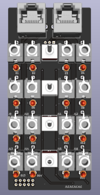

# Ether Twin

A platform for sharing control voltage and audio over RJ45 shielded network cable

Note: These modules are still a work in progress and may contain errors.

## Ether Twin v1 - Stand-alone

Stand-alone passive desktop version.

Follow the ibom component placement guide [here](https://htmlpreview.github.io/?https://github.com/awonak/ether-twin/blob/main/ether_v1/bom/ibom.html).

Step by step build guide [here](ether_v1/README.md).

## Ether Twin v2 - 3U

Rack mount 3U 10HP version

